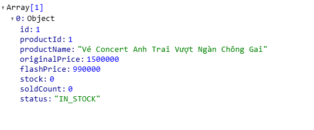

# High-Concurency-Flash-Sale-Engine

# K6 test load redis
  █ THRESHOLDS 

    http_req_failed{status:500}
    ✓ 'rate<0.01' rate=0.00%

  █ TOTAL RESULTS 

    checks_total.......: 32130  912.606558/s
    checks_succeeded...: 32.71% 10512 out of 32130
    checks_failed......: 67.28% 21618 out of 32130

    ✗ Status 200 (Mua thành công)
      ↳  0% — ✓ 57 / ✗ 10653
    ✗ Status 429 (Bị Chặn Spam)
      ↳  97% — ✓ 10455 / ✗ 255
    ✗ Status 400 (Báo Hết Hàng)
      ↳  0% — ✓ 0 / ✗ 10710

    HTTP
    http_req_duration..............: avg=2s    min=0s       med=1.91s max=7.59s p(90)=3.61s p(95)=3.89s
      { expected_response:true }...: avg=2.89s min=244.4ms  med=2.61s max=7.59s p(90)=4.65s p(95)=4.9s 
    http_req_failed................: 99.46% 10653 out of 10710
      { status:500 }...............: 0.00%  0 out of 0
    http_reqs......................: 10710  304.202186/s

    EXECUTION
    iteration_duration.............: avg=2.21s min=145.32ms med=2.11s max=7.73s p(90)=3.82s p(95)=4.08s
    iterations.....................: 10710  304.202186/s
    vus............................: 33     min=0              max=1000
    vus_max........................: 1000   min=996            max=1000

    NETWORK
    data_received..................: 2.9 MB 82 kB/s
    data_sent......................: 1.2 MB 35 kB/s

running (0m35.2s), 0000/1000 VUs, 10710 complete and 0 interrupted iterations
default ✓ [======================================] 0000/1000 VUs  35s

# K6 sync test 
█ TOTAL RESULTS 

    checks_total.......: 15729  397.463798/s
    checks_succeeded...: 27.29% 4293 out of 15729
    checks_failed......: 72.70% 11436 out of 15729

    ✗ Status 200 (Mua thành công)
      ↳  1% — ✓ 100 / ✗ 5143
    ✗ Status 5xx / Lock / Timeout (Lỗi Server/DB)
      ↳  0% — ✓ 0 / ✗ 5243
    ✗ Status 400 (Hết hàng)
      ↳  79% — ✓ 4193 / ✗ 1050

    HTTP
    http_req_duration..............: avg=1.64s    min=0s       med=569.17ms max=12.86s   p(90)=6.21s    p(95)=6.79s   
      { expected_response:true }...: avg=135.56ms min=18ms     med=115.93ms max=460.56ms p(90)=234.06ms p(95)=267.11ms
    http_req_failed................: 98.09% 5143 out of 5243
    http_reqs......................: 5243   132.487933/s

    EXECUTION
    iteration_duration.............: avg=5.2s     min=109.71ms med=1.11s    max=26.19s   p(90)=19.45s   p(95)=20.16s  
    iterations.....................: 5243   132.487933/s
    vus............................: 74     min=3            max=1000
    vus_max........................: 1000   min=1000         max=1000

    NETWORK
    data_received..................: 1.2 MB 30 kB/s
    data_sent......................: 520 kB 13 kB/s

running (0m39.6s), 0000/1000 VUs, 5243 complete and 0 interrupted iterations
default ✓ [======================================] 0000/1000 VUs  35s
